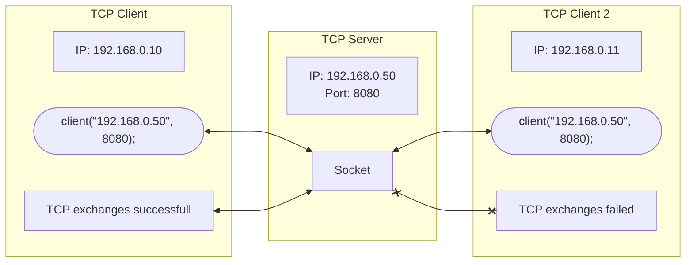

# Context

This projet is part of a **Proof of Concept** *(POC)* for a larger private project. 

As a result, the code is commented in French — apologies for that. 
It is also structured to support automatic documentation generation using Doxygen.

# Multiclient TCP Server

I encountered several issues when transitioning from a single‑client TCP server to a multi‑client TCP server. 
Sharing the same server instance can lead to socket concurrency problems. 
Let’s take a look at the structural differences to better understand this behavior. 

## Single client

The client connects to the socket. 
It can send messages as long as the socket remains open. 
A limitation of this architecture is that issues arise when attempting to connect multiple clients simultaneously. 

## Multiclient

Clients connect one by one to the main socket. 
This socket listens for incoming client/server connections, then redirects each client to a dedicated thread. 
This allows each client to maintain its own individual socket connection. 
As a result, there are no inter-client conflicts with this approach. 